# Documentación Completa - AppChat

**Proyecto**: AppChat - Aplicación de Mensajería Instantánea  
**Asignatura**: Tecnologías de Desarrollo de Software (TDS)  
**Curso**: 4º PCEO - Universidad de Murcia  
**Fecha**: 22 de junio de 2025  
**Profesor**: Jose Ramón Hoyos Barcelo
**Duración del Proyecto**: 28 de abril - 22 de junio de 2025 (55 días)
**Proyecto desarrollado por:** Rubén Moyano Palazón y Alejandro Cerezal Jiménez
---

## Índice de Contenidos

1. [Historias de Usuario](#1-historias-de-usuario)
2. [Diagrama de Clases del Dominio](#2-diagrama-de-clases-del-dominio)
3. [Diagrama de Secuencia - Añadir Contacto a Grupo](#3-diagrama-de-secuencia---añadir-contacto-a-grupo)
4. [Arquitectura de la Aplicación y Decisiones de Diseño](#4-arquitectura-de-la-aplicación-y-decisiones-de-diseño)
   - 4.1. [Arquitectura General](#41-arquitectura-general)
   - 4.2. [Decisiones de Diseño Principales](#42-decisiones-de-diseño-principales)
   - 4.3. [Patrones de Diseño Implementados](#43-patrones-de-diseño-implementados)
   - 4.4. [Tecnologías y Herramientas](#44-tecnologias-y-herramientas)
5. [Manual de Usuario](#5-manual-de-usuario)
   - 5.1. [Introducción](#51-introducción)
   - 5.2. [Instalación y Primer Uso](#52-instalación-y-primer-uso)
   - 5.3. [Registro e Inicio de Sesión](#53-registro-e-inicio-de-sesión)
   - 5.4. [Interfaz Principal](#54-interfaz-principal)
   - 5.5. [Gestión de Contactos](#55-gestión-de-contactos)
   - 5.6. [Envío de Mensajes](#56-envío-de-mensajes)
   - 5.7. [Grupos de Difusión](#57-grupos-de-difusión)
   - 5.8. [Funciones Premium](#58-funciones-premium)
   - 5.9. [Búsqueda de Mensajes](#59-búsqueda-de-mensajes)
6. [Observaciones Finales](#6-observaciones-finales)

---

## 1 Historias de Usuario

### 1. Registro de un nuevo usuario

**Como** usuario no registrado,  
**quiero** poder registrarme en el sistema proporcionando mis datos personales,  
**para** poder acceder a la aplicación de mensajería y utilizar sus funcionalidades.

**Criterios de Verificación:**
- El formulario de registro debe solicitar al menos los siguientes datos: nombre completo, fecha de nacimiento (opcional), email, imagen de perfil (opcional), número de teléfono y contraseña.
- El usuario debe repetir la contraseña para verificarla.
- El sistema debe validar que todos los campos obligatorios estén completos.
- Si el registro es exitoso, el usuario debe recibir una confirmación y ser redirigido a la página de inicio de sesión.
- Si el número de teléfono ya está registrado, el sistema debe mostrar un mensaje de error adecuado.

---

### 2. Inicio de sesión

**Como** usuario registrado,  
**quiero** iniciar sesión en la aplicación utilizando mi número de teléfono y contraseña,  
**para** acceder a mis contactos y mensajes.

**Criterios de Verificación:**
- El formulario de inicio de sesión debe permitir introducir el número de teléfono y la contraseña.
- El sistema debe validar que las credenciales coincidan con las de un usuario registrado.
- Si el inicio de sesión es exitoso, el usuario debe ser redirigido a la pantalla principal de la aplicación.
- Si el número de teléfono o la contraseña no coinciden, el sistema debe mostrar un mensaje de error.

---

### 3. Añadir contacto

**Como** usuario registrado,  
**quiero** añadir un nuevo contacto a mi lista de contactos,  
**para** poder enviarle mensajes fácilmente.

**Criterios de Verificación:**
- El usuario debe poder añadir un contacto proporcionando un número de teléfono y un nombre asociado.
- El sistema debe validar que el número de teléfono no esté ya en la lista de contactos del usuario.
- Si el número de teléfono no existe en el sistema, el sistema debe notificar al usuario con un mensaje de error.
- El nuevo contacto debe aparecer en la lista de contactos del usuario una vez añadido con éxito.

---

### 4. Crear grupo

**Como** usuario,  
**quiero** crear un grupo de contactos,  
**para** facilitar el envío de mensajes a varios contactos al mismo tiempo.

**Criterios de Verificación:**
- El sistema debe permitir al usuario crear un grupo proporcionando un nombre para el grupo y opcionalmente una imagen.
- El usuario debe poder añadir varios contactos existentes al grupo.
- El sistema debe validar que el nombre del grupo no esté vacío.
- El grupo recién creado debe aparecer en la lista de contactos del usuario.
- El usuario debe poder modificar la lista de miembros del grupo o eliminar el grupo.

---

### 5. Enviar y recibir mensajes

**Como** usuario registrado,  
**quiero** enviar y recibir mensajes a/de mis contactos,  
**para** poder comunicarme con ellos de forma rápida y eficiente.

**Criterios de Verificación:**
- El usuario debe poder seleccionar un contacto o un grupo de su lista de contactos para enviar un mensaje.
- El mensaje debe incluir texto o un emoticono, y se debe registrar con la fecha y hora de envío.
- El mensaje debe aparecer inmediatamente en la ventana de conversación una vez enviado, y mostrar el nombre y la hora de envío.
- Si se recibe un mensaje de un usuario que no es un contacto, se debe mostrar su número de teléfono en vez del nombre en el mensaje.
- Si el emisor no está en la lista de contactos del usuario, el sistema debe permitir al usuario añadirlo como contacto.
- Los mensajes enviados a un grupo se envían individualmente a cada uno de los contactos del grupo.

---

### 6. Convertirse en usuario premium

**Como** usuario registrado,  
**quiero** poder convertirme en usuario premium pagando una suscripción,  
**para** acceder a funciones adicionales como la exportación de mensajes.

**Criterios de Verificación:**
- El sistema debe permitir al usuario registrarse como premium mediante el pago de una suscripción anual.
- El usuario premium debe ver un icono o indicador que confirme su estado premium.
- El sistema debe aplicar descuentos automáticos basados en la fecha de registro o el número de mensajes enviados en el último mes.
- El usuario premium debe tener acceso a funciones adicionales como la exportación de mensajes en PDF.
- El usuario debe poder cancelar la suscripción premium en cualquier momento, y el sistema debe revertir el acceso a las funcionalidades premium tras la cancelación.

---

### 7. Buscar mensajes

**Como** usuario registrado,  
**quiero** buscar mensajes por fragmento de texto, nombre de contacto o número de teléfono,  
**para** encontrar fácilmente los mensajes que necesito.

**Criterios de Verificación:**
- El sistema debe permitir buscar mensajes enviados o recibidos por el usuario filtrando por fragmento de texto, nombre del contacto o número de teléfono.
- Los resultados de la búsqueda deben mostrarse en forma de lista, ordenados por fecha y hora de envío.
- El sistema debe permitir combinar varios criterios de búsqueda (por ejemplo, texto y contacto).
- Al hacer clic en un mensaje de los resultados de la búsqueda, se debe abrir la conversación completa en la interfaz de usuario.

---

### 8. Exportar mensajes a PDF (solo premium)

**Como** usuario premium,  
**quiero** exportar mis conversaciones con un contacto a un archivo PDF,  
**para** tener un registro de los mensajes intercambiados.

**Criterios de Verificación:**
- El sistema debe permitir al usuario seleccionar una conversación para exportarla a PDF.
- El archivo PDF debe incluir los nombres de los participantes, el contenido del mensaje, y la fecha y hora de cada mensaje.
- El archivo PDF debe generarse correctamente y descargarse en el dispositivo del usuario.

---

### 9. Añadir contacto a un grupo

**Como** usuario,  
**quiero** añadir un nuevo contacto a un grupo de contactos,  
**para** que reciba los mensajes que se envíen.

**Criterios de Verificación:**
- El sistema debe validar que el contacto a modificar es un grupo.
- El sistema debe permitir al usuario modificar un grupo proporcionando una lista de los contactos disponibles y una lista de los contactos actuales del grupo.
- El usuario debe poder añadir varios contactos que no pertenezcan al grupo a este.
- El sistema debe validar que en el grupo haya al menos un contacto.
- El grupo recién modificado debe aparecer actualizado en la lista de contactos del usuario.

---

### 10. Eliminar contacto de un grupo

**Como** usuario,  
**quiero** eliminar un contacto de un grupo de contactos,  
**para** que no reciba los mensajes que se envíen.

**Criterios de Verificación:**
- El sistema debe validar que el contacto a modificar es un grupo.
- El sistema debe permitir al usuario modificar un grupo proporcionando una lista de los contactos disponibles y una lista de los contactos actuales del grupo.
- El usuario debe poder eliminar varios contactos que pertenezcan al grupo de este.
- El sistema debe validar que en el grupo haya al menos un contacto.
- El grupo recién modificado debe aparecer actualizado en la lista de contactos del usuario.

---

### 11. Desactivar cuenta premium

**Como** usuario premium,
**quiero** cancelar mi suscripción premium,  
**para** no pagar y dejar de acceder a servicios especiales.

**Criterios de Verificación:**
- El sistema debe verificar que el usuario es actualmente premium.
- El usuario premium dejará de ver un icono o indicador que confirme su estado premium.
- El sistema ya no aplicará descuentos automáticos basados en la fecha de registro o el número de mensajes enviados en el último mes.
- El usuario registrado no debe tener acceso a funciones adicionales como la exportación de mensajes en PDF.
- El usuario debe poder pagar la suscripción premium en cualquier momento, y el sistema debe otorgar el acceso a las funcionalidades premium tras el pago.

---


## 2. Diagrama de Clases del Dominio

Este diagrama muestra las clases principales del modelo de dominio de AppChat con sus atributos y relaciones.

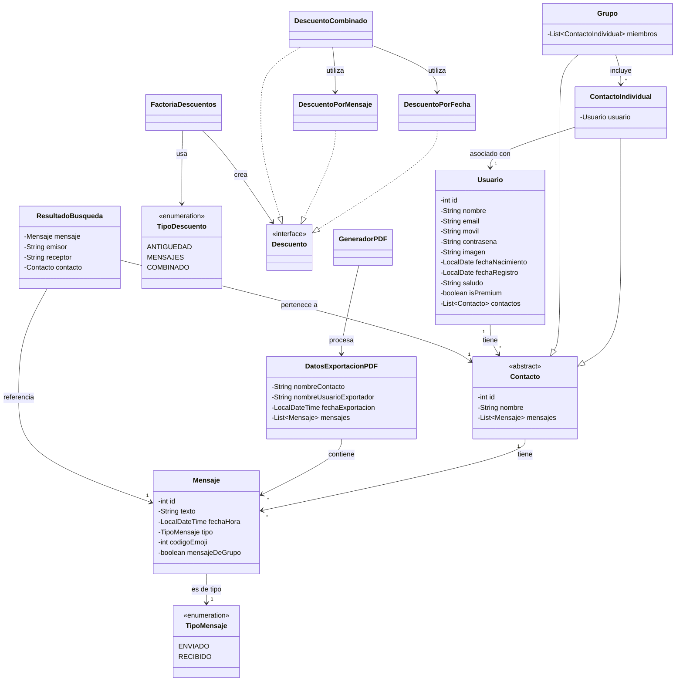
```mermaid
classDiagram
    %% Clases principales del modelo
    class Usuario {
        -int id
        -String nombre
        -String email
        -String movil
        -String contrasena
        -String imagen
        -LocalDate fechaNacimiento
        -LocalDate fechaRegistro
        -String saludo
        -boolean isPremium
        -List~Contacto~ contactos
    }

    class Contacto {
        <<abstract>>
        -int id
        -String nombre
        -List~Mensaje~ mensajes
    }

    class ContactoIndividual {
        -Usuario usuario
    }

    class Grupo {
        -List~ContactoIndividual~ miembros
    }

    class Mensaje {
        -int id
        -String texto
        -LocalDateTime fechaHora
        -TipoMensaje tipo
        -int codigoEmoji
        -boolean mensajeDeGrupo
    }

    %% Enumeraciones
    class TipoMensaje {
        <<enumeration>>
        ENVIADO
        RECIBIDO
    }

    class TipoDescuento {
        <<enumeration>>
        ANTIGUEDAD
        MENSAJES
        COMBINADO
    }

    %% Sistema de descuentos - agrupados juntos
    class Descuento {
        <<interface>>
    }

    class DescuentoPorFecha {
    }
    
    class DescuentoPorMensaje {
    }
    
    class DescuentoCombinado {
    }

    class FactoriaDescuentos {
    }

    %% Funcionalidades adicionales
    class DatosExportacionPDF {
        -String nombreContacto
        -String nombreUsuarioExportador
        -LocalDateTime fechaExportacion
        -List~Mensaje~ mensajes
    }

    class GeneradorPDF

    class ResultadoBusqueda {
        -Mensaje mensaje
        -String emisor
        -String receptor
        -Contacto contacto
    }

    %% Relaciones de herencia
    ContactoIndividual --|> Contacto
    Grupo --|> Contacto

    %% Relaciones de implementación - descuentos juntos
    DescuentoPorFecha ..|> Descuento
    DescuentoPorMensaje ..|> Descuento
    DescuentoCombinado ..|> Descuento

    %% Relaciones internas del sistema de descuentos
    FactoriaDescuentos --> TipoDescuento : usa
    FactoriaDescuentos --> Descuento : crea
    DescuentoCombinado --> DescuentoPorFecha : utiliza
    DescuentoCombinado --> DescuentoPorMensaje : utiliza

    %% Relaciones de asociación y composición
    Usuario "1" --> "*" Contacto : tiene
    ContactoIndividual --> "1" Usuario : asociado con
    Grupo --> "*" ContactoIndividual : incluye
    Contacto "1" --> "*" Mensaje : tiene
    Mensaje --> "1" TipoMensaje : es de tipo

    %% Relaciones de dependencia
    DatosExportacionPDF --> "*" Mensaje : contiene
    GeneradorPDF --> DatosExportacionPDF : procesa
    ResultadoBusqueda --> "1" Mensaje : referencia
    ResultadoBusqueda --> "1" Contacto : pertenece a
```

### Descripción del Modelo

#### Clases Principales
- **Usuario**: Clase central que representa los usuarios del sistema con sus datos personales y lista de contactos
- **Contacto**: Clase abstracta base que define la estructura común para contactos individuales y grupos
- **ContactoIndividual**: Clase concreta de `Contacto` que representa a otro usuario individual del sistema
- **Grupo**: Clase concreta de `Contacto` que representa un grupo formado por múltiples `ContactoIndividual`
- **Mensaje**: Representa los mensajes intercambiados entre contactos con información de fecha, tipo y contenido

#### Enumerados
- **TipoMensaje**: Define si un mensaje es `ENVIADO` o `RECIBIDO` desde la perspectiva del usuario actual
- **TipoDescuento**: Enumera los tipos de descuento disponibles (`ANTIGUEDAD`, `MENSAJES`, `COMBINADO`)

#### Sistema de Descuentos (Patrón Estrategia)
- **Descuento**: Interfaz que define el comportamiento común para calcular descuentos
- **DescuentoPorFecha**: Implementación que calcula descuentos basados en la antigüedad del usuario
- **DescuentoPorMensaje**: Implementación que calcula descuentos según la cantidad de mensajes enviados
- **DescuentoCombinado**: Implementación que combina los criterios anteriores para obtener el mejor descuento
- **FactoriaDescuentos**: Factoría que crea instancias de las diferentes estrategias de descuento

#### Funcionalidades Adicionales
- **DatosExportacionPDF**: Encapsula la información necesaria para generar exportaciones de conversaciones en formato PDF
- **GeneradorPDF**: Utilidad que procesa los datos de exportación para generar archivos PDF
- **ResultadoBusqueda**: Representa los resultados de búsquedas de mensajes con información contextual

---

## 3. Diagrama de Secuencia - Añadir Contacto a Grupo

Este diagrama muestra la secuencia de interacciones para añadir un nuevo contacto a un grupo existente.

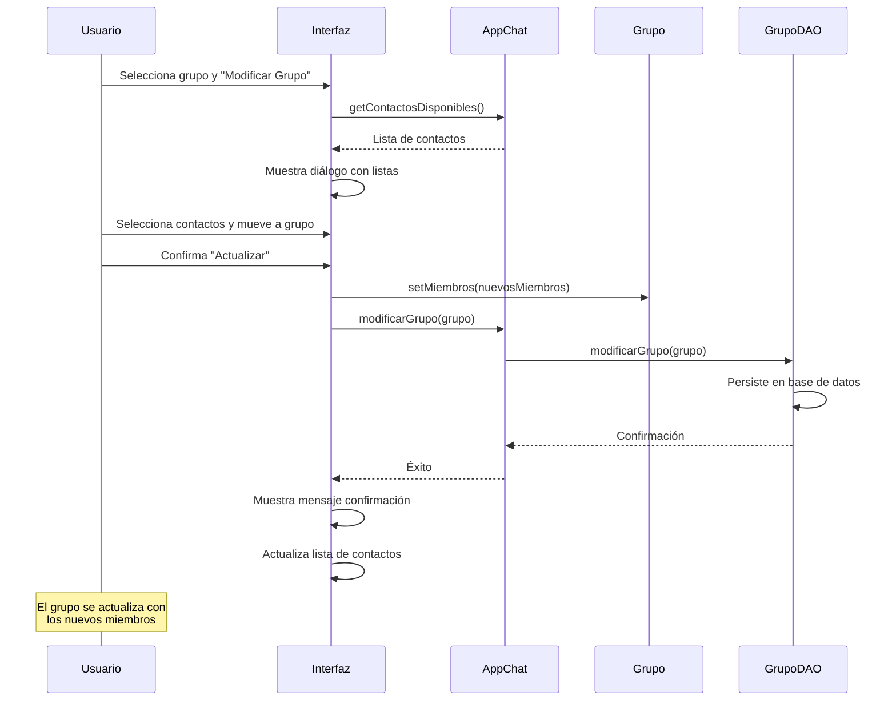
```mermaid
sequenceDiagram
    participant U as Usuario
    participant UI as Interfaz
    participant AC as AppChat
    participant G as Grupo
    participant DAO as GrupoDAO

    U->>UI: Selecciona grupo y "Modificar Grupo"
    UI->>AC: getContactosDisponibles()
    AC-->>UI: Lista de contactos
    UI->>UI: Muestra diálogo con listas
    
    U->>UI: Selecciona contactos y mueve a grupo
    U->>UI: Confirma "Actualizar"
    
    UI->>G: setMiembros(nuevosMiembros)
    UI->>AC: modificarGrupo(grupo)
    AC->>DAO: modificarGrupo(grupo)
    DAO->>DAO: Persiste en base de datos
    DAO-->>AC: Confirmación
    AC-->>UI: Éxito
    
    UI->>UI: Muestra mensaje confirmación
    UI->>UI: Actualiza lista de contactos
    
    Note over U: El grupo se actualiza con<br/>los nuevos miembros
```

---

## 4. Arquitectura de la Aplicación y Decisiones de Diseño

### 4.1. Arquitectura General

La aplicación está organizada en cuatro capas principales:

- **Vista**: Interfaz gráfica de usuario (Swing)
- **Controlador**: Lógica de negocio y coordinación (AppChat)
- **Modelo**: Entidades del dominio (Usuario, Contacto, Mensaje, Grupo, etc.)
- **Persistencia**: Acceso y almacenamiento de datos (DAO, TDS)

Cada capa tiene responsabilidades bien definidas y se comunican entre sí de forma estructurada para facilitar el mantenimiento y la extensibilidad.

**Estructura de Directorios:**
```
src/main/java/umu/tds/appchat/
├── controlador/     # Lógica de negocio y coordinación
├── modelo/          # Entidades del dominio
├── vista/           # Interfaz gráfica de usuario
└── persistencia/    # Acceso a datos
```

#### Patrón MVC

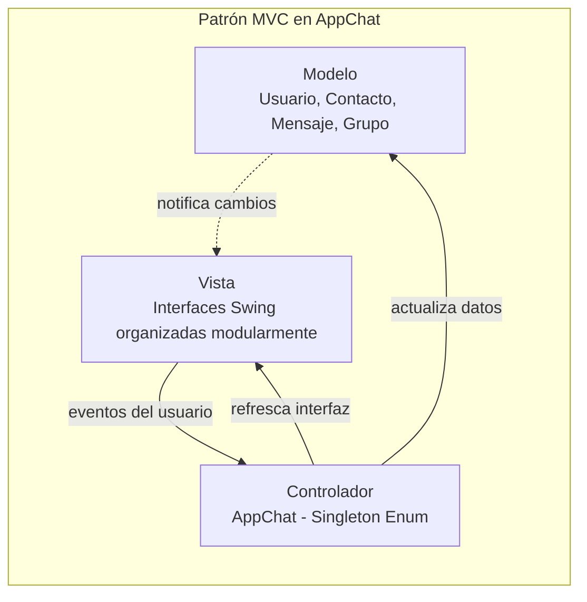
```mermaid
graph LR
    subgraph "Patrón MVC en AppChat"
        Model[Modelo<br/>Usuario, Contacto, Mensaje, Grupo]
        View[Vista<br/>Interfaces Swing organizadas modularmente]
        Controller[Controlador<br/>AppChat - Singleton Enum]
    end
    
    View -->|eventos del usuario| Controller
    Controller -->|actualiza datos| Model
    Controller -->|refresca interfaz| View
    Model -.->|notifica cambios| View
```

- **Modelo**: Clases del dominio (Usuario, Contacto, Mensaje, Grupo)
- **Vista**: Interfaces gráficas Swing organizadas modularmente
- **Controlador**: Clase `AppChat` que coordina toda la lógica de negocio

### 4.2. Decisiones de Diseño Principales

### 1. Controlador Principal como Singleton Enum

**Decisión**: Implementar `AppChat` como un enum singleton.

```java
public enum AppChat {
    INSTANCE;
    // ...
}
```

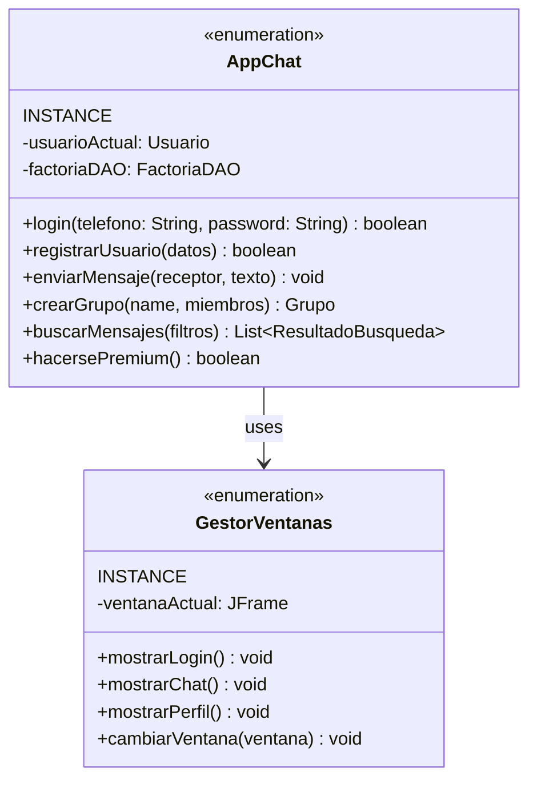
```mermaid
classDiagram
    class AppChat {
        <<enumeration>>
        INSTANCE
        -usuarioActual: Usuario
        -factoriaDAO: FactoriaDAO
        +login(telefono: String, password: String) boolean
        +registrarUsuario(datos) boolean
        +enviarMensaje(receptor, texto) void
        +crearGrupo(name, miembros) Grupo
        +buscarMensajes(filtros) List~ResultadoBusqueda~
        +hacersePremium() boolean
    }
    
    class GestorVentanas {
        <<enumeration>>
        INSTANCE
        -ventanaActual: JFrame
        +mostrarLogin() void
        +mostrarChat() void
        +mostrarPerfil() void
        +cambiarVentana(ventana) void
    }
    
    AppChat --> GestorVentanas : uses
```

**Justificación**: 
- Garantiza una única instancia del controlador
- Thread-safe por defecto
- Previene reflexión y serialización
- Más conciso que el patrón Singleton tradicional

**Referencia**: Issue #7 - "Implementar Controlador Principal"

### 2. Arquitectura de Persistencia con Patrón DAO

**Decisión**: Implementar una capa de persistencia usando el patrón DAO (Data Access Object) con Factory.

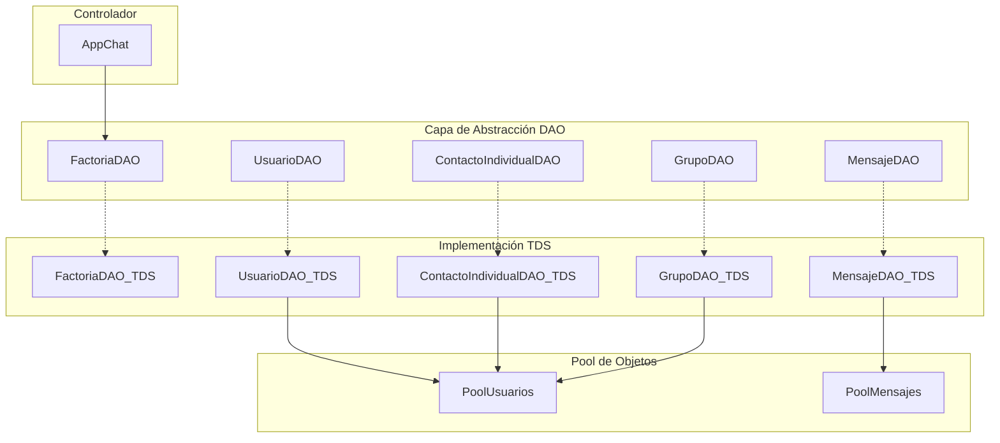
```mermaid
graph TB
    subgraph "Capa de Abstracción DAO"
        FAC[FactoriaDAO]
        UDAO[UsuarioDAO]
        CDAO[ContactoIndividualDAO]
        GDAO[GrupoDAO]
        MDAO[MensajeDAO]
    end
    
    subgraph "Implementación TDS"
        FACT[FactoriaDAO_TDS]
        UDAOT[UsuarioDAO_TDS]
        CDAOT[ContactoIndividualDAO_TDS]
        GDAOT[GrupoDAO_TDS]
        MDAOT[MensajeDAO_TDS]
    end
    
    subgraph "Pool de Objetos"
        PU[PoolUsuarios]
        PM[PoolMensajes]
    end
    
    subgraph "Controlador"
        AC[AppChat]
    end
    
    AC --> FAC
    FAC -.-> FACT
    UDAO -.-> UDAOT
    CDAO -.-> CDAOT
    GDAO -.-> GDAOT
    MDAO -.-> MDAOT
    
    UDAOT --> PU
    MDAOT --> PM
    CDAOT --> PU
    GDAOT --> PU
```

**Estructura**:
```
dao/
├── FactoriaDAO.java          # Factory abstracta
├── UsuarioDAO.java           # Interfaz para usuarios
├── ContactoIndividualDAO.java
├── GrupoDAO.java
└── MensajeDAO.java

persistencia/
├── FactoriaDAO_TDS.java      # Implementación concreta
├── UsuarioDAO_TDS.java
├── ContactoIndividualDAO_TDS.java
├── GrupoDAO_TDS.java
├── MensajeDAO_TDS.java
├── PoolUsuarios.java         # Pool de objetos
└── PoolMensajes.java
```

**Beneficios**:
- Separación clara entre lógica de negocio y persistencia
- Facilita el cambio de sistema de persistencia
- Testabilidad mejorada

**Referencia**: Issue #6 - "Implementar Factoría DAO y DAOs Base"

### 3. Pool de Objetos para Evitar Ciclos

**Decisión**: Implementar pools de objetos (`PoolUsuarios`, `PoolMensajes`) para gestionar referencias circulares.

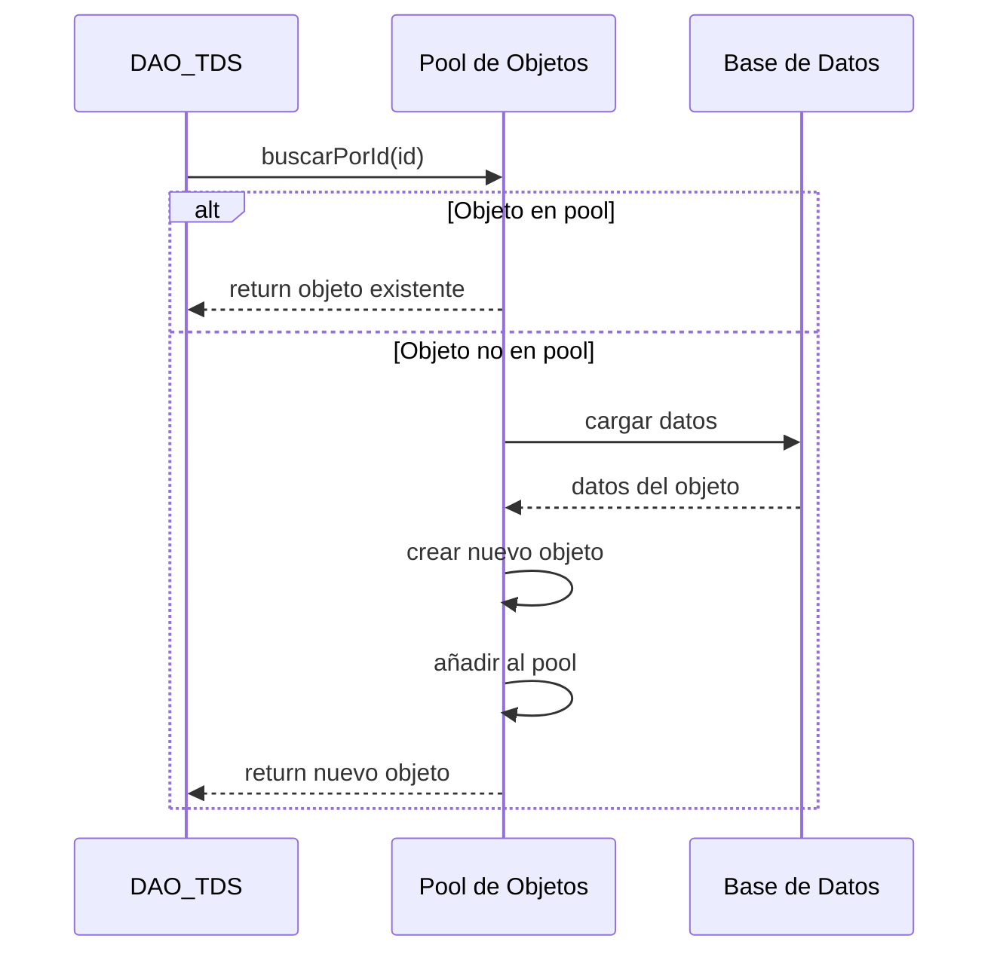
```mermaid
sequenceDiagram
    participant DAO as DAO_TDS
    participant Pool as Pool de Objetos
    participant DB as Base de Datos
    
    DAO->>Pool: buscarPorId(id)
    alt Objeto en pool
        Pool-->>DAO: return objeto existente
    else Objeto no en pool
        Pool->>DB: cargar datos
        DB-->>Pool: datos del objeto
        Pool->>Pool: crear nuevo objeto
        Pool->>Pool: añadir al pool
        Pool-->>DAO: return nuevo objeto
    end
```

**Problema Resuelto**: Evitar problemas de carga infinita en relaciones bidireccionales.

**Implementación**:
```java
public enum PoolUsuarios {
    INSTANCE;
    private Map<Integer, Usuario> pool = new HashMap<>();
    // ...
}
```

**Referencia**: Issue #15, #28

### 4. Arquitectura Modular de Vista

**Decisión**: Organizar la vista en una estructura modular con separación de responsabilidades.

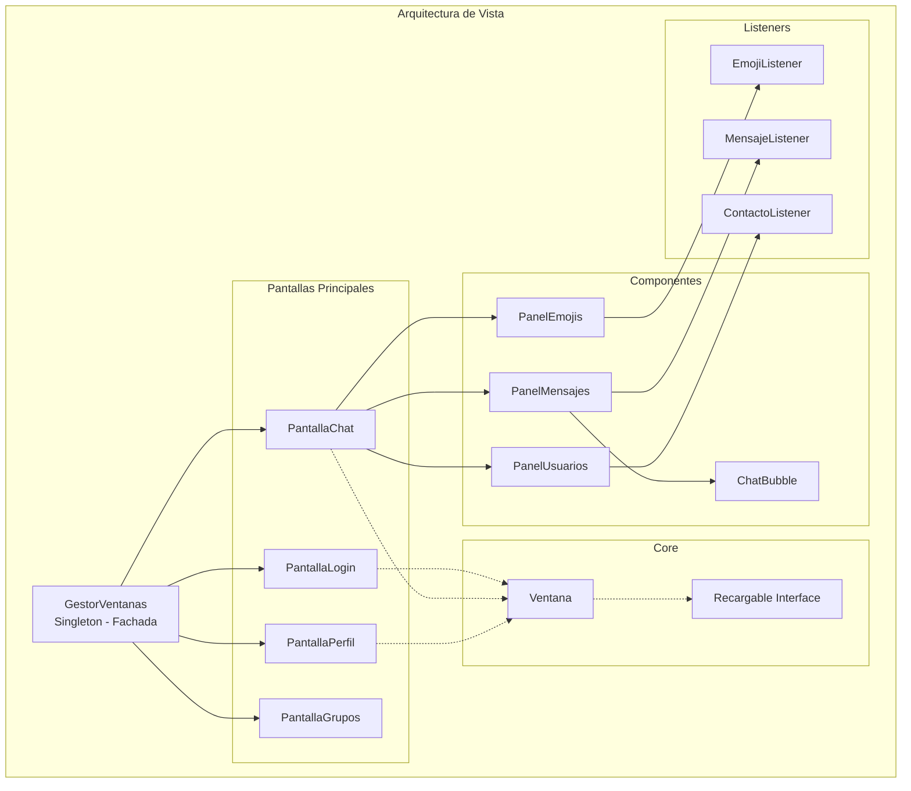
```mermaid
graph TB
    subgraph "Arquitectura de Vista"
        GV[GestorVentanas<br/>Singleton - Fachada]
        
        subgraph "Pantallas Principales"
            PL[PantallaLogin]
            PC[PantallaChat]
            PP[PantallaPerfil]
            PG[PantallaGrupos]
        end
        
        subgraph "Componentes"
            PM[PanelMensajes]
            PE[PanelEmojis]
            PU[PanelUsuarios]
            CB[ChatBubble]
        end
        
        subgraph "Core"
            VB[Ventana]
            R[Recargable Interface]
        end
        
        subgraph "Listeners"
            EL[EmojiListener]
            ML[MensajeListener]
            CL[ContactoListener]
        end
    end
    
    GV --> PL
    GV --> PC
    GV --> PP
    GV --> PG
    
    PC --> PM
    PC --> PE
    PC --> PU
    PM --> CB
    
    PL -.-> VB
    PC -.-> VB
    PP -.-> VB
    
    VB -.-> R
    
    PE --> EL
    PM --> ML
    PU --> CL
```

**Estructura**:
```
vista/
├── componentes/     # Componentes reutilizables
├── core/           # Gestión de ventanas y abstracciones
├── pantallas/      # Ventanas específicas
├── util/           # Utilidades de diseño
└── listeners/      # Interfaces de eventos
```

**Patrón Gestor de Ventanas**: Singleton `GestorVentanas` implementando los patrones Fachada/Mediador.

**Beneficios**:
- Una ventana por funcionalidad visual
- Reutilización de componentes
- Fácil navegación entre ventanas
- Mantenimiento simplificado

**Referencia**: Issue #16 - Comentarios sobre estructura de vista

### 5. Sistema de Descuentos con Patrón Strategy

**Decisión**: Implementar un sistema flexible de descuentos usando el patrón Strategy.

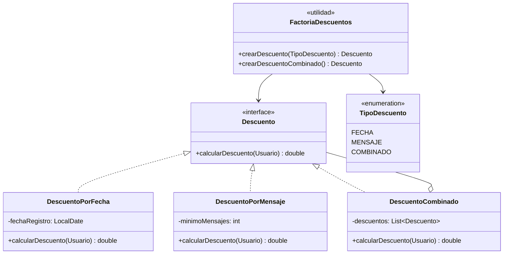
```mermaid
classDiagram
    class Descuento {
        <<interface>>
        +calcularDescuento(Usuario) double
    }
    
    class DescuentoPorFecha {
        -fechaRegistro: LocalDate
        +calcularDescuento(Usuario) double
    }
    
    class DescuentoPorMensaje {
        -minimoMensajes: int
        +calcularDescuento(Usuario) double
    }
    
    class DescuentoCombinado {
        -descuentos: List~Descuento~
        +calcularDescuento(Usuario) double
    }
    
    class FactoriaDescuentos {
        <<utilidad>>
        +crearDescuento(TipoDescuento) Descuento
        +crearDescuentoCombinado() Descuento
    }
    
    class TipoDescuento {
        <<enumeration>>
        FECHA
        MENSAJE
        COMBINADO
    }
    
    Descuento <|.. DescuentoPorFecha
    Descuento <|.. DescuentoPorMensaje
    Descuento <|.. DescuentoCombinado
    FactoriaDescuentos --> Descuento
    FactoriaDescuentos --> TipoDescuento
    DescuentoCombinado o-- Descuento
```

**Estructura**:
```java
interface Descuento {
    double calcularDescuento(Usuario usuario);
}

class DescuentoPorFecha implements Descuento { }
class DescuentoPorMensaje implements Descuento { }
class DescuentoCombinado implements Descuento { }

class FactoriaDescuentos {
    static Descuento crearDescuento(TipoDescuento tipo) { }
}
```

**Beneficios**:
- Extensibilidad para nuevos tipos de descuento
- Separación de lógicas de cálculo
- Uso de lambdas e introspección

**Referencia**: Issue #52 - "Implementar Lógica Convertir a Premium"

### 6. Patrón Observer para Selección de Emojis

**Decisión**: Implementar el patrón Observer para la comunicación entre el panel de emojis y el panel de mensajes.

**Diagrama de Interacción**:
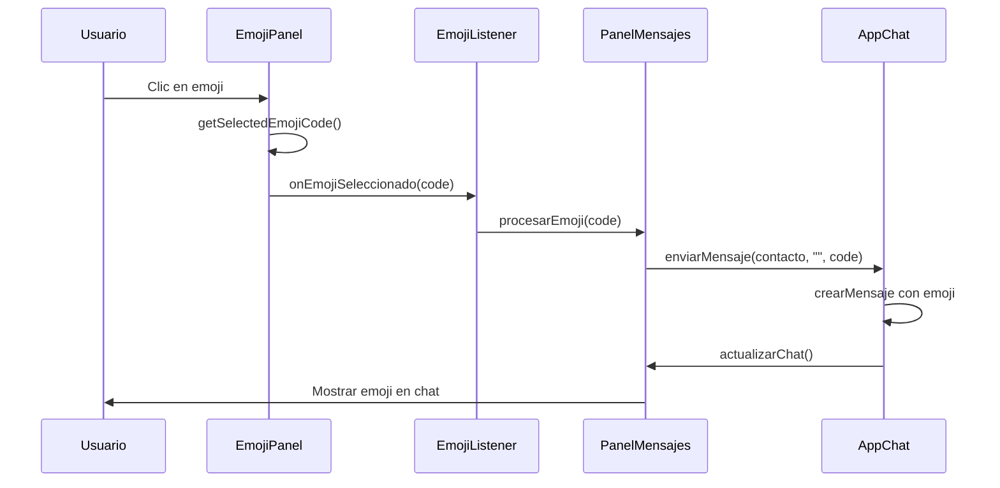
```mermaid
sequenceDiagram
    participant Usuario
    participant EmojiPanel
    participant EmojiListener
    participant PanelMensajes
    participant AppChat
    
    Usuario->>EmojiPanel: Clic en emoji
    EmojiPanel->>EmojiPanel: getSelectedEmojiCode()
    EmojiPanel->>EmojiListener: onEmojiSeleccionado(code)
    EmojiListener->>PanelMensajes: procesarEmoji(code)
    PanelMensajes->>AppChat: enviarMensaje(contacto, "", code)
    AppChat->>AppChat: crearMensaje con emoji
    AppChat->>PanelMensajes: actualizarChat()
    PanelMensajes->>Usuario: Mostrar emoji en chat
```

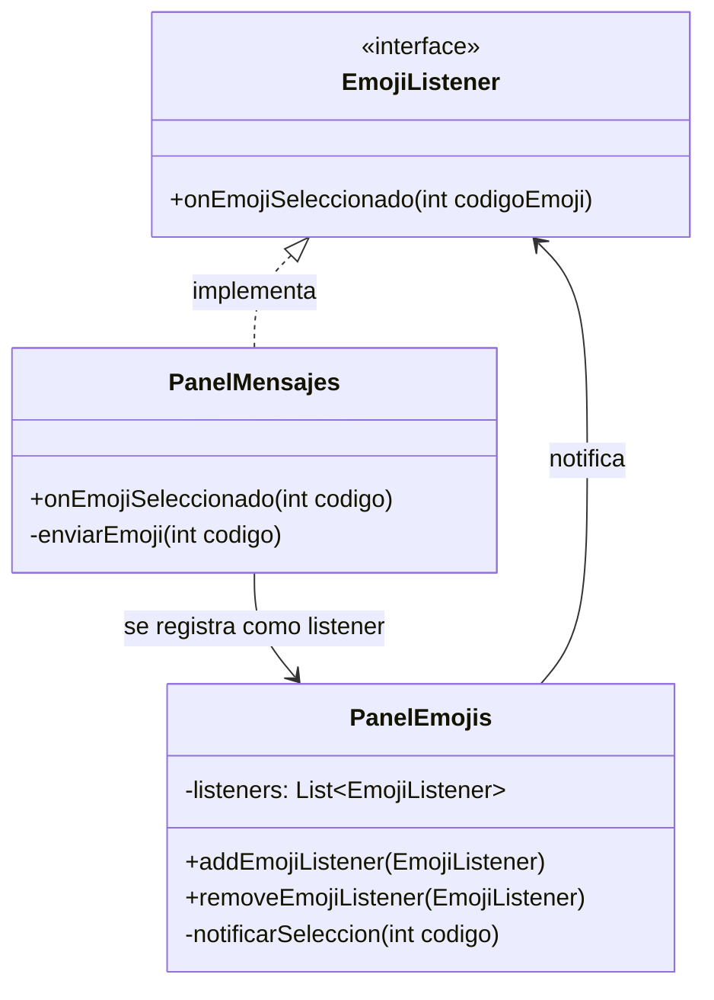
```mermaid
classDiagram
    class EmojiListener {
        <<interface>>
        +onEmojiSeleccionado(int codigoEmoji)
    }
    
    class PanelEmojis {
        -listeners: List~EmojiListener~
        +addEmojiListener(EmojiListener)
        +removeEmojiListener(EmojiListener)
        -notificarSeleccion(int codigo)
    }
    
    class PanelMensajes {
        +onEmojiSeleccionado(int codigo)
        -enviarEmoji(int codigo)
    }
    
    PanelEmojis --> EmojiListener : notifica
    EmojiListener <|.. PanelMensajes : implementa
    PanelMensajes --> PanelEmojis : se registra como listener
```

**Beneficios**:
- Bajo acoplamiento entre componentes
- Comunicación asíncrona
- Fácil extensión para nuevos observadores

**Referencia**: Issue #29 - Comentarios sobre patrón Observer

### 7. Separación Estricta MVC

**Decisión**: Mantener una separación estricta entre capas, evitando violaciones del patrón MVC.

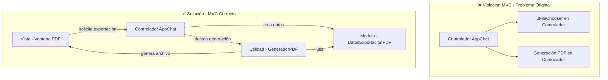
```mermaid
flowchart TB
    subgraph "❌ Violación MVC - Problema Original"
        C1[Controlador AppChat]
        UI1[JFileChooser en Controlador]
        PDF1[Generación PDF en Controlador]
    end
    
    subgraph "✅ Solución - MVC Correcto"
        V2[Vista - Ventana PDF]
        C2[Controlador AppChat]
        M2[Modelo - DatosExportacionPDF]
        U2[Utilidad - GeneradorPDF]
    end
    
    C1 --> UI1
    C1 --> PDF1
    
    V2 -->|solicita exportación| C2
    C2 -->|crea datos| M2
    C2 -->|delega generación| U2
    U2 -->|usa| M2
    U2 -->|genera archivo| V2
```

**Ejemplo de Refactoring**: 
- **Problema**: Código de UI en el controlador (JFileChooser)
- **Solución**: Crear clase `DatosExportacionPDF` y `GeneradorPDF` siguiendo el patrón Expert

**Beneficios**:
- Responsabilidades claramente definidas
- Código más testeable
- Mejor mantenibilidad

**Referencia**: Issue #54 - Comentarios sobre violación MVC

### 8. Gestión de Grupos como Difusión

**Decisión**: Implementar grupos como "grupos de difusión" en lugar de chats grupales persistentes.

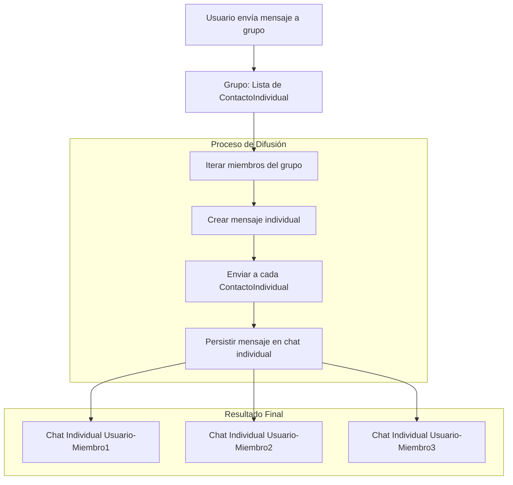
```mermaid
flowchart TD
    U[Usuario envía mensaje a grupo]
    G[Grupo: Lista de ContactoIndividual]
    
    subgraph "Proceso de Difusión"
        F[Iterar miembros del grupo]
        C[Crear mensaje individual]
        S[Enviar a cada ContactoIndividual]
        P[Persistir mensaje en chat individual]
    end
    
    subgraph "Resultado Final"
        C1[Chat Individual Usuario-Miembro1]
        C2[Chat Individual Usuario-Miembro2]
        C3[Chat Individual Usuario-Miembro3]
    end
    
    U --> G
    G --> F
    F --> C
    C --> S
    S --> P
    P --> C1
    P --> C2
    P --> C3
```

**Comportamiento**:
- Al enviar mensaje a un grupo, se envía individualmente a cada miembro
- No hay historial grupal compartido
- Cada usuario ve los mensajes en sus chats individuales

Con esto se simplifica la persistencia y se cumple con los requisitos de la aplicación.

**Referencia**: Issue #40 - "Implementar Lógica Enviar Mensaje a Grupo"

### 9. Manejo de Contactos Desconocidos

**Decisión**: Crear automáticamente contactos "sin nombre" cuando se reciben mensajes de números no agregados.

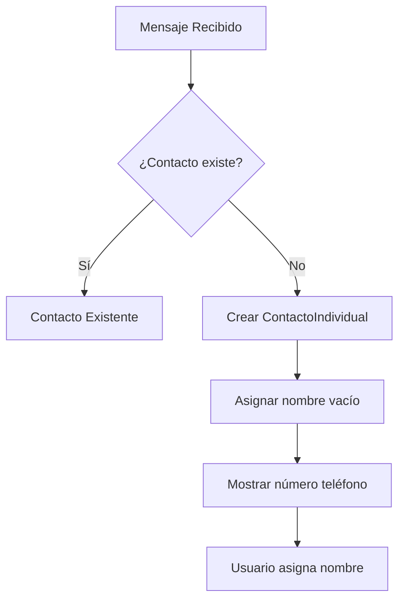
```mermaid
flowchart TD
    MR[Mensaje Recibido]
    DC{¿Contacto existe?}
    CE[Contacto Existente]
    CC[Crear ContactoIndividual]
    SN[Asignar nombre vacío]
    MT[Mostrar número teléfono]
    AN[Usuario asigna nombre]
    
    MR --> DC
    DC -->|Sí| CE
    DC -->|No| CC
    CC --> SN
    SN --> MT
    MT --> AN
```

**Flujo**:
1. Mensaje recibido de número desconocido
2. Se crea `ContactoIndividual` con nombre vacío
3. Se muestra el número de teléfono en la interfaz
4. El usuario puede asignar nombre posteriormente

**Beneficios**:
- No se pierden mensajes
- Experiencia de usuario fluida
- Gestión automática de contactos

**Referencia**: Issue #32 - "Añadir Contacto desde Mensaje Recibido"

### 10. Uso de Streams para Búsquedas

**Ejemplo**: Búsqueda de mensajes usando Java 8 Streams.

```java
return usuarioActual.getContactos().stream()
    .filter(contacto -> /* filtros */)
    .flatMap(contacto -> contacto.getMensajes().stream())
    .filter(mensaje -> /* filtros de texto y tipo */)
    .map(mensaje -> new ResultadoBusqueda(mensaje, emisor, receptor, contacto))
    .sorted(Comparator.comparing(r -> r.getMensaje().getFechaHora()).reversed())
    .collect(Collectors.toList());
```

**Referencia**: Issue #50 - "Implementar Lógica Buscar Mensajes"

### 11. Manejo de Emojis

**Decisión**: Usar un campo `codigoEmoji` en la clase `Mensaje` donde `-1` indica mensaje de texto y valores positivos representan códigos de emoji.

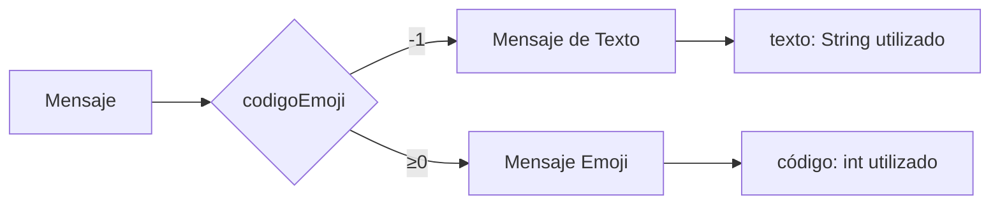
```mermaid
graph LR
    M[Mensaje]
    CE{codigoEmoji}
    MT[Mensaje de Texto]
    ME[Mensaje Emoji]
    
    M --> CE
    CE -->|-1| MT
    CE -->|≥0| ME
    
    MT --> T[texto: String utilizado]
    ME --> E[código: int utilizado]
```

**Justificación**: Evita sobrecargar el enum `TipoMensaje` con responsabilidades no relacionadas.

**Referencia**: Issue #42 - "Arreglar persistencia de emoticonos"

### 12. Exportación PDF Premium

**Arquitectura**:

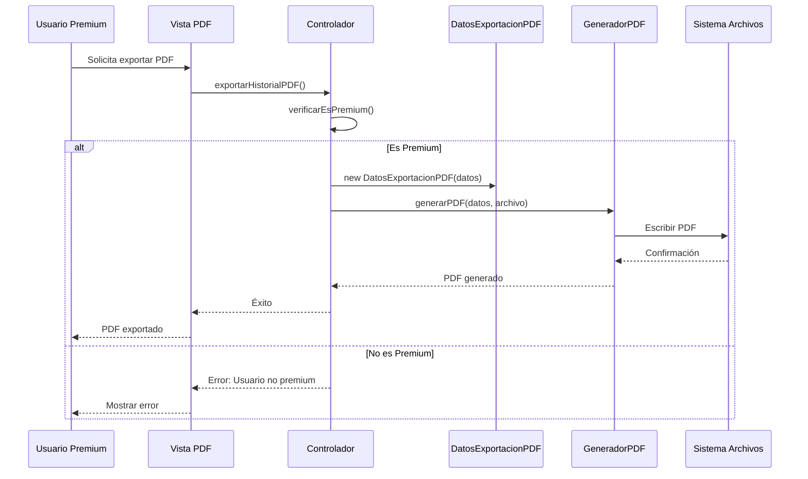
```mermaid
sequenceDiagram
    participant U as Usuario Premium
    participant V as Vista PDF
    participant C as Controlador
    participant D as DatosExportacionPDF
    participant G as GeneradorPDF
    participant F as Sistema Archivos
    
    U->>V: Solicita exportar PDF
    V->>C: exportarHistorialPDF()
    C->>C: verificarEsPremium()
    alt Es Premium
        C->>D: new DatosExportacionPDF(datos)
        C->>G: generarPDF(datos, archivo)
        G->>F: Escribir PDF
        F-->>G: Confirmación
        G-->>C: PDF generado
        C-->>V: Éxito
        V-->>U: PDF exportado
    else No es Premium
        C-->>V: Error: Usuario no premium
        V-->>U: Mostrar error
    end
```

- `DatosExportacionPDF`: Encapsula datos necesarios
- `GeneradorPDF`: Lógica de generación (siguiendo el patrón Experto)
- Verificación de usuario premium en controlador

**Beneficios**: Separación de responsabilidades y reutilización.


### 4.3. Patrones de Diseño Implementados

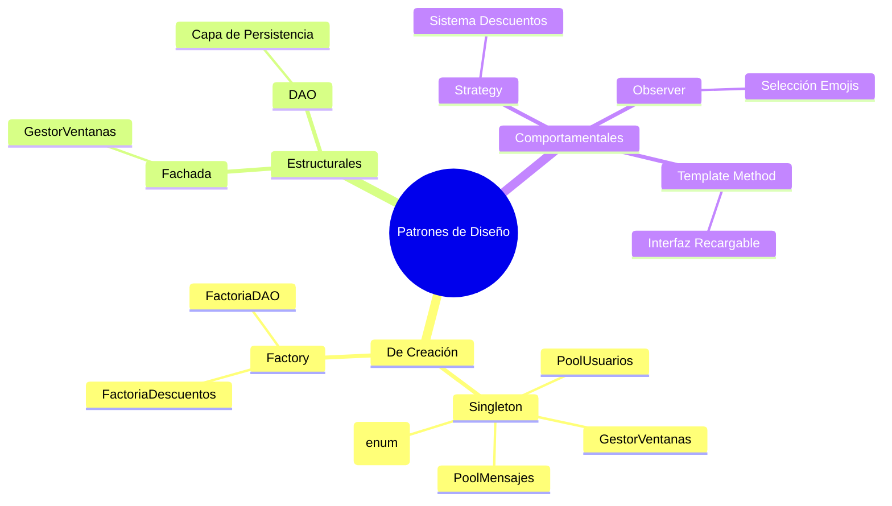
```mermaid
mindmap
  root((Patrones de Diseño))
    De Creación
      Singleton
        AppChat (enum)
        GestorVentanas
        PoolUsuarios
        PoolMensajes
      Factory
        FactoriaDAO
        FactoriaDescuentos
    Estructurales
      Fachada
        GestorVentanas
      DAO
        Capa de Persistencia
    Comportamentales
      Strategy
        Sistema Descuentos
      Observer
        Selección Emojis
      Template Method
        Interfaz Recargable
```

#### 4.3.1 De Creación
- **Singleton**: `AppChat` (enum), `GestorVentanas`, `PoolUsuarios`, `PoolMensajes`
- **Factory**: `FactoriaDAO`, `FactoriaDescuentos`

#### 4.3.2 Estructurales
- **Fachada**: `GestorVentanas` como fachada para gestión de ventanas
- **DAO**: Capa de acceso a datos

#### 4.3.3 Comportamentales
- **Strategy**: Sistema de descuentos
- **Observer**: Selección de emojis
- **Template Method**: Interfaz `Recargable` para actualización de ventanas

### 4.4 Tecnologías y Herramientas

**Persistencia**
- **TDS Driver**: Sistema de persistencia proporcionado por los profesores de la asignatura
- **H2 Database**: Base de datos embebida
- **Maven**: Gestión de dependencias

**UI**
- **Swing**: Framework para la interfaz gráfica
- **JCalendar**: Selector de fechas
- **iTextPDF**: Generación de documentos PDF

**Arquitectura**
- **Java 8+**: Uso de streams, lambdas y API moderna
- **Maven**: Estructura de proyecto estándar

---

## 5. Manual de Usuario

### 5.1. Introducción

**AppChat** es una aplicación de mensajería instantánea desarrollada en Java que te permite comunicarte con tus contactos mediante mensajes de texto y emojis. La aplicación cuenta con funciones básicas gratuitas y características premium para usuarios suscritos.

#### Características Principales
- ✅ Mensajería instantánea con texto y emojis
- ✅ Gestión de contactos individuales
- ✅ Creación de grupos de difusión
- ✅ Búsqueda avanzada de mensajes
- ✅ Funciones premium (exportar chats a PDF)
- ✅ Interfaz intuitiva y fácil de usar

### 5.2. Instalación y Primer Uso

#### Requisitos del Sistema
- Java 8 o superior
- Sistema operativo: Windows, macOS o Linux

#### Instalación
1. Descarga el archivo `AppChat.jar`
2. Ejecuta el comando: `java -jar AppChat.jar`
3. La aplicación se iniciará automáticamente

#### Primera Ejecución
Al iniciar AppChat por primera vez, verás la **Pantalla de Bienvenida** con las opciones:
- **Iniciar Sesión**: Para usuarios registrados
- **Registrarse**: Para nuevos usuarios

### 5.3. Registro e Inicio de Sesión

#### Registro de Usuario

Para crear una nueva cuenta en AppChat:

1. En la pantalla de bienvenida, haz clic en **"Iniciar Sesión"**
2. En la ventana de login, haz clic en **"¿No tienes cuenta? Regístrate aquí"**
3. Completa el formulario de registro:

**Campos Obligatorios (*):**
- **Nombre**: Tu nombre completo
- **Teléfono**: Número de móvil (solo números)
- **Contraseña**: Crea una contraseña segura
- **Confirmar Contraseña**: Repite la contraseña
- **Fecha de Nacimiento**: Selecciona tu fecha de nacimiento

**Campos Opcionales:**
- **Email**: Tu dirección de correo electrónico
- **Saludo**: Mensaje personalizado para tu perfil
- **URL Imagen de Perfil**: Enlace a tu foto de perfil

#### Consejos para el Registro
- 📱 El número de teléfono será tu identificador único
- 🔒 Usa una contraseña segura (mínimo 6 caracteres)
- 🖼️ La imagen de perfil debe ser una URL válida

4. Haz clic en **"Registrar"**
5. Si el registro es exitoso, serás redirigido automáticamente al login

#### Inicio de Sesión

1. En la ventana de login, ingresa:
   - **Teléfono**: Tu número de móvil registrado
   - **Contraseña**: Tu contraseña
2. Haz clic en **"Iniciar Sesión"**

### 5.4. Interfaz Principal

Una vez iniciada la sesión, accederás a la **Ventana Principal** que consta de:

#### Barra Superior
- **Botones de Acción**: Agregar contacto, crear grupo, ver contactos, etc.
- **Información del Usuario**: Tu nombre y foto de perfil
- **Botón Premium**: Acceso a funciones premium
- **Logout**: Cerrar sesión

#### Panel Izquierdo - Lista de Contactos
- Muestra todos tus contactos individuales y grupos
- Haz clic en cualquier contacto para abrir el chat

#### Panel Derecho - Área de Mensajes
- **Historial de Chat**: Conversación con el contacto seleccionado
- **Área de Escritura**: Campo para escribir mensajes
- **Botones**: Enviar mensaje y selector de emojis

### 5.5. Gestión de Contactos

#### Agregar Nuevo Contacto
1. Haz clic en **"Agregar nuevo contacto"** en la barra superior
2. Completa los datos:
   - **Nombre**: Nombre del contacto
   - **Teléfono**: Número de móvil del contacto
3. Haz clic en **"Aceptar"**

> **Nota**: El contacto debe estar registrado en AppChat para poder agregarlo.

#### Contactos Desconocidos
- Si recibes un mensaje de un número no agregado, AppChat creará automáticamente un contacto
- El contacto aparecerá con el número de teléfono
- Puedes asignarle un nombre posteriormente

#### Ver Lista Completa de Contactos
1. Haz clic en **"Ver Contactos"** en la barra superior
2. Se abrirá una tabla con todos tus contactos y sus detalles
3. Haz clic en cualquier contacto para seleccionarlo en el chat principal

### 5.6. Envío de Mensajes

#### Mensajes de Texto
1. Selecciona un contacto del panel izquierdo
2. Escribe tu mensaje en el área de texto inferior
3. Presiona **Enter** o haz clic en **"Enviar"**

#### Atajos de Teclado
- **Ctrl + Enter**: Enviar mensaje (funciona desde el área de texto)

#### Mensajes con Emojis
1. Selecciona un contacto
2. Haz clic en el **botón de emoji** (😊) junto al botón Enviar
3. Selecciona el emoji deseado del panel
4. El emoji se enviará automáticamente

#### Tipos de Mensajes
- **Texto**: Mensajes escritos normales
- **Emojis**: Emoticones enviados como mensajes especiales
- Los mensajes aparecen en diferentes colores:
  - 🟢 **Verde**: Mensajes enviados por ti
  - ⚪ **Gris**: Mensajes recibidos

### 5.7. Grupos de Difusión

AppChat utiliza **grupos de difusión**, lo que significa que los mensajes se envían individualmente a cada miembro.

#### Crear Nuevo Grupo
1. Haz clic en **"Crear nuevo grupo"**
2. Ingresa el **nombre del grupo**
3. Selecciona contactos de la lista:
   - **Lista izquierda**: Contactos disponibles
   - **Botones >> y <<**: Mover contactos entre listas
   - **Lista derecha**: Miembros del grupo
4. Haz clic en **"Crear Grupo"**

#### Modificar Grupo Existente
1. Selecciona un grupo de la lista de contactos
2. Haz clic en **"Modificar Grupo"**
3. Ajusta los miembros usando las listas
4. Haz clic en **"Actualizar"**

#### Enviar Mensajes a Grupos
1. Selecciona el grupo de la lista
2. Escribe tu mensaje
3. Haz clic en **"Enviar"**
4. El mensaje se enviará individualmente a cada miembro

> **Importante**: Los mensajes de grupo aparecen en los chats individuales de cada miembro.

### 5.8. Funciones Premium

#### Suscripción Premium
1. Haz clic en **"Premium"** en la barra superior
2. Revisa los beneficios y el precio
3. Haz clic en **"Pagar y Activar Premium"**
4. Confirma el pago

#### Beneficios Premium
- ⭐ **Exportar Chats a PDF**: Guarda conversaciones en formato PDF
- ⭐ **Insignia Premium**: Tu nombre aparece con una estrella dorada
- ⭐ **Descuentos especiales** aplicados automáticamente

#### Exportar Chat a PDF (Solo Premium)
1. Selecciona un **contacto individual** (no funciona con grupos)
2. Haz clic en **"Exportar Chat PDF"**
3. Ingresa el nombre del archivo
4. Haz clic en **"Exportar"**
5. El archivo PDF se guardará en tu sistema

#### Cancelar Suscripción Premium
1. Siendo usuario premium, haz clic en **"Premium"**
2. Selecciona **"Cancelar Suscripción"**
3. Confirma la cancelación

### 5.9. Búsqueda de Mensajes

#### Buscar en Todas las Conversaciones
1. Haz clic en **"Buscar Mensajes"** en la barra superior
2. Usa los filtros disponibles:

**Filtros de Búsqueda:**
- **Texto**: Buscar mensajes que contengan palabras específicas
- **Contacto**: Filtrar por nombre de contacto
- **Teléfono**: Filtrar por número de teléfono
- **Tipo de Mensaje**: 
  - AMBOS (enviados y recibidos)
  - ENVIADO (solo los que enviaste)
  - RECIBIDO (solo los recibidos)

3. Haz clic en **"Buscar"**
4. Los resultados aparecerán en una lista
5. Haz clic en cualquier resultado para ir directamente a esa conversación

---

## 6. Observaciones Finales

El desarrollo de **AppChat** ha sido un proyecto completo de aplicación de mensajería desarrollada en Java con arquitectura MVC, que ha abarcado desde la implementación básica de registro y login hasta funcionalidades avanzadas como grupos de difusión, búsqueda de mensajes, exportación a PDF para usuarios premium y persistencia.

### Estimación de Tiempo Dedicado

#### Distribución Temporal del Desarrollo
- **Fecha de inicio**: 28 de abril de 2025
- **Fecha de finalización**: 22 de junio de 2025
- **Duración total**: **55 días** (aproximadamente 8 semanas)

#### Análisis por Categorías de Issues (Total: 55 issues)

**Por Componente de Arquitectura:**
- **Persistencia**: 8 issues (15% del total)
- **Vista**: 12 issues (22% del total) 
- **Controlador**: 8 issues (15% del total)
- **Dominio**: 4 issues (7% del total)
- **Historias de Usuario**: 3 issues (5% del total)
- **Bugs y Correcciones**: 2 issues (4% del total)
- **Otros**: 18 issues (32% del total)

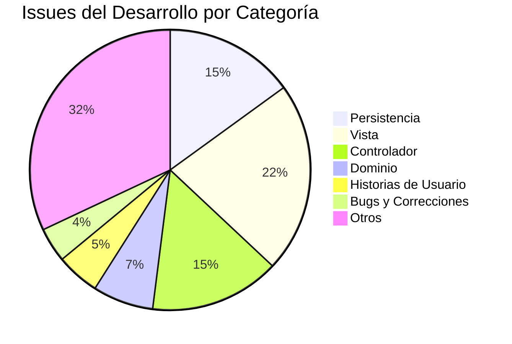
```mermaid
pie title Issues del Desarrollo por Categoría
    "Persistencia" : 15
    "Vista" : 22
    "Controlador" : 15
    "Dominio" : 7
    "Historias de Usuario" : 5
    "Bugs y Correcciones" : 4
    "Otros" : 32

```

### Observaciones del Proceso de Desarrollo

#### Enfoque de Desarrollo Vertical

Hemos seguido **desarrollo vertical por funcionalidades**. En lugar de desarrollar toda una capa completa antes de pasar a la siguiente, adoptamos un enfoque donde cada funcionalidad se implementó completamente a través de todas las capas de la arquitectura:

**Patrón de Implementación: Persistencia → Dominio → Controlador → Vista**

Para cada funcionalidad seguimos sistemáticamente este orden:

1. **Persistencia**: Implementación de DAOs y mapeo de entidades
2. **Dominio**: Clases del modelo y lógica de negocio
3. **Controlador**: Métodos de `AppChat`
4. **Vista**: Interfaces gráficas y componentes Swing

#### Ejemplo del desarrollo: Registro de Usuarios (Issues #13-#19)
```
Issue #15: UsuarioDAO (Persistencia)
    ↓
Issue #14: Lógica de Registro (Controlador)  
    ↓
Issue #16: GUI Ventana Registro (Vista)
    ↓
Issue #17: Conexión GUI-Dominio (Integración)
```

Este patrón se repitió consistentemente para todas las funcionalidades.

#### Fases Principales del Desarrollo

1. **Configuración Inicial** (Issues #1-#7)
   - Configuración de Maven y dependencias
   - Estructura de capas MVC
   - Integración del driver de persistencia TDS

2. **Acceso de Usuarios** (Issues #13-#19)
   - Implementación de registro y login
   - Persistencia de usuarios
   - Interfaces gráficas básicas

3. **Contactos y Mensajería** (Issues #20-#32)
   - Gestión de contactos individuales
   - Envío y recepción de mensajes
   - Panel de chat y lista de contactos

4. **Grupos de Difusión** (Issues #36-#48)
   - Implementación de grupos
   - Persistencia de grupos
   - Interfaces para crear/modificar grupos

5. **Funcionalidades Avanzadas** (Issues #49-#55)
   - Búsqueda de mensajes
   - Sistema premium
   - Exportación a PDF
   - Tabla de contactos

#### Gestión de Issues
Cada Historia de Usuario se dividió en tareas pequeñas por capa, lo que facilitó la organización del trabajo vertical. Los issues relacionados se referenciaron entre sí para mantener la trazabilidad del desarrollo.

El proyecto ha demostrado la importancia de una arquitectura bien diseñada y la aplicación correcta de patrones de diseño para crear una aplicación mantenible y extensible.


#### Tiempo estimado

- Rubén Moyano Palazón: 40 horas
- Alejandro Cerezal Jiménez: 40 horas
---

